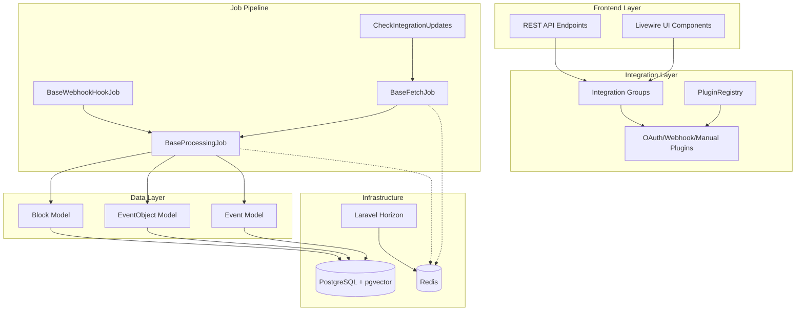

# WARP.md

This file provides guidance to WARP (warp.dev) when working with code in this repository.

## Quick Start (TL;DR)

**Spark** is a Laravel 12 + Livewire 3 integration platform that connects external services (health, finance, media, etc.) and transforms their data into a unified event/object/block system using a sophisticated job pipeline.

```bash
# Start development environment
./vendor/bin/sail up -d

# Run all development services (web, horizon, logs, vite)
composer dev

# Run tests
./vendor/bin/sail artisan test

# Lint and format code
./vendor/bin/sail composer lint
./vendor/bin/sail composer format
```

## Table of Contents

- [Architecture Overview](#architecture-overview)
- [Development Commands](#development-commands)
- [Integration Plugin System](#integration-plugin-system)
- [Job Pipeline Architecture](#job-pipeline-architecture)
- [Testing Strategy](#testing-strategy)
- [Database & Queue Setup](#database--queue-setup)
- [Frontend Stack](#frontend-stack)
- [Development Patterns](#development-patterns)
    - [Git Conventions](#git-conventions)

## Architecture Overview

Spark is built around a **plugin-based integration system** that fetches data from external APIs and webhooks, processes it through a job pipeline, and stores it in a unified event/object/block format.

### Core Components



### Key Architectural Concepts

1. **Multi-Instance Integration Groups**: Each service (e.g., Monzo, Spotify) can have multiple instances (accounts, playlists) that share the same OAuth token via `IntegrationGroup`
2. **Job-Based Data Pipeline**: Separates data fetching from processing for better scalability and error handling
3. **Plugin Registry**: Discovers and manages integration plugins with metadata for domains (health, money, media, knowledge, online)
4. **Unified Data Model**: All external data is transformed into `Event`, `EventObject`, and `Block` models with standardized schemas

## Development Commands

### Environment Setup

```bash
# Install dependencies
composer install
npm install

# Copy environment configuration
cp .env.example .env

# Generate application key
./vendor/bin/sail artisan key:generate

# Start Docker services
./vendor/bin/sail up -d

# Run database migrations
./vendor/bin/sail artisan migrate

# Seed database (if seeders exist)
./vendor/bin/sail artisan db:seed
```

### Development Workflow

```bash
# Start all development services simultaneously
composer dev
# This runs: server, horizon, logs (pail), and vite dev server

# Alternative: Start services individually
./vendor/bin/sail artisan serve
./vendor/bin/sail artisan horizon
./vendor/bin/sail artisan pail --timeout=0
npm run dev
```

### Testing

```bash
# Run all tests
./vendor/bin/sail artisan test

# Run specific test file
./vendor/bin/sail artisan test tests/Feature/AppleHealthIntegrationTest.php

# Run tests with coverage
./vendor/bin/sail artisan test --coverage

# Run specific test suite
./vendor/bin/sail artisan test --testsuite=Unit
./vendor/bin/sail artisan test --testsuite=Feature
```

### Code Quality

```bash
# Run Laravel Pint (PHP CS Fixer)
./vendor/bin/sail composer format

# Check code style without fixing
./vendor/bin/sail composer lint

# Run Prettier on frontend files
npm run prettier

# Build frontend assets
npm run build
npm run dev
```

### Database Operations

```bash
# Reset database and re-run migrations
./vendor/bin/sail artisan migrate:fresh

# Rollback migrations
./vendor/bin/sail artisan migrate:rollback

# Check migration status
./vendor/bin/sail artisan migrate:status
```

### Queue & Background Jobs

```bash
# Process queue jobs
./vendor/bin/sail artisan queue:work

# Start Laravel Horizon dashboard
./vendor/bin/sail artisan horizon

# Check queue status
./vendor/bin/sail artisan queue:status

# Clear failed jobs
./vendor/bin/sail artisan queue:clear

# Retry failed jobs
./vendor/bin/sail artisan queue:retry all

# Run scheduler (for periodic jobs)
./vendor/bin/sail artisan schedule:work
```

### Integration Management

```bash
# Manually trigger integration updates
./vendor/bin/sail artisan integrations:check

# Fetch data for specific integration
./vendor/bin/sail artisan integrations:fetch {integration_id}

# Show integration configuration
./vendor/bin/sail artisan integrations:show-config {service_name}

# Monitor job queue health
./vendor/bin/sail artisan jobs:health
```

## Integration Plugin System

### Plugin Registration

All plugins extend the `IntegrationPlugin` interface and are automatically registered in `App\Integrations\PluginRegistry`. The registry categorizes plugins by:

- **Service Type**: `oauth`, `webhook`, `manual`, `apikey`
- **Domain**: `health`, `money`, `media`, `knowledge`, `online`
- **Instance Types**: Different data types the plugin can handle (e.g., `transactions`, `accounts`, `sleep`, `workouts`)

### Plugin Structure

```php
// Example: MonzoPlugin extends OAuthPlugin
class MonzoPlugin extends OAuthPlugin
{
    public static function getIdentifier(): string { return 'monzo'; }
    public static function getDisplayName(): string { return 'Monzo'; }
    public static function getDomain(): string { return 'money'; }
    public static function getInstanceTypes(): array {
        return [
            'transactions' => ['label' => 'Transactions', 'schema' => [...]],
            'accounts' => ['label' => 'Accounts', 'schema' => [...]],
            'pots' => ['label' => 'Pots & Savings', 'schema' => [...]],
        ];
    }
}
```

### Integration Lifecycle

1. **Group Creation**: `initializeGroup()` creates an `IntegrationGroup` with OAuth/webhook credentials
2. **OAuth Flow**: `handleOAuthCallback()` exchanges authorization code for tokens
3. **Instance Creation**: `createInstance()` creates specific integration instances (e.g., transaction tracking)
4. **Data Fetching**: Scheduled jobs dispatch `BaseFetchJob` implementations
5. **Data Processing**: Fetch jobs dispatch `BaseProcessingJob` implementations to create events/objects/blocks

### Supported Integrations

- **Health**: Apple Health (webhook), Oura (OAuth), Hevy (API key)
- **Finance**: Monzo (OAuth), GoCardless (OAuth)
- **Media**: Spotify (OAuth)
- **Development**: GitHub (OAuth)

## Job Pipeline Architecture

### Job Hierarchy

The job system separates **fetching** from **processing** for better scalability and error handling:

```php
CheckIntegrationUpdates
├── BaseFetchJob implementations
│   ├── MonzoTransactionPull
│   ├── SpotifyListeningPull
│   └── OuraActivityPull
└── BaseProcessingJob implementations
    ├── MonzoTransactionData
    ├── SpotifyListeningData
    └── OuraActivityData
```

### Base Job Classes

- **`BaseFetchJob`**: OAuth API calls, 2min timeout, 3 retries with backoff
- **`BaseProcessingJob`**: Data transformation, 5min timeout, 2 retries
- **`BaseWebhookHookJob`**: Webhook validation and splitting, 1min timeout

### Job Patterns

```php
// Fetch job example
class MonzoTransactionPull extends BaseFetchJob
{
    protected function fetchData(): array {
        // Make API calls using group's access_token
    }

    protected function dispatchProcessingJobs(array $rawData): void {
        // Dispatch processing jobs with fetched data
        MonzoTransactionData::dispatch($this->integration, $rawData);
    }
}
```

### Enhanced Idempotency

Jobs use the `EnhancedIdempotency` trait to prevent duplicate processing:

```php
public function uniqueId(): string {
    return $this->serviceName . '_' . $this->getJobType() . '_' .
           $this->integration->id . '_' . now()->toDateString();
}
```

## Testing Strategy

### Test Structure

```
tests/
├── Unit/                 # Fast, isolated tests
│   ├── Jobs/            # Job logic and behavior
│   ├── Models/          # Model relationships and methods
│   └── Integrations/    # Plugin configuration and logic
├── Feature/             # Integration tests with database
│   ├── Auth/            # Authentication flows
│   ├── Integration/     # End-to-end integration flows
│   └── Api/             # API endpoint testing
└── Fakes/               # Test doubles and mock objects
```

### Testing Patterns

```php
// Job testing example
public function test_monzo_transaction_fetch_dispatches_processing_jobs()
{
    Queue::fake();

    $integration = Integration::factory()->create([
        'service' => 'monzo',
        'instance_type' => 'transactions'
    ]);

    $job = new MonzoTransactionPull($integration);
    $job->dispatchProcessingJobs(['transactions' => [...]]);

    Queue::assertPushed(MonzoTransactionData::class);
}
```

### Test Commands

```bash
# Run tests with specific focus
./vendor/bin/sail artisan test --filter=Job
./vendor/bin/sail artisan test --filter=Integration
./vendor/bin/sail artisan test --group=oauth
```

## Database & Queue Setup

### Database Requirements

- **PostgreSQL 17** with **pgvector** extension for vector similarity searches
- Configured in `docker-compose.yml` with automatic extension installation

### Queue Configuration

```php
// config/queue.php
'connections' => [
    'redis' => [
        'driver' => 'redis',
        'queue' => ['default', 'fetch', 'process', 'webhook'],
        // Different queues for different job priorities
    ],
],
```

### Horizon Monitoring

Laravel Horizon provides real-time queue monitoring at `/horizon`. Key features:

- Job throughput metrics
- Failed job management
- Queue length monitoring
- Worker supervision

## Frontend Stack

### Technology Stack

- **Laravel 12** with Livewire 3 for reactive components
- **Vite** for asset bundling and HMR
- **TailwindCSS 4** with **DaisyUI** components
- **Alpine.js** for JavaScript interactions (via Livewire)

### Build Commands

```bash
# Development with hot reload
npm run dev

# Production build
npm run build

# Build for semantic release
npm run release
```

### Frontend Structure

```
resources/
├── css/app.css          # TailwindCSS entry point
├── js/app.js            # JavaScript/Alpine entry point
└── views/
    ├── livewire/        # Livewire component templates
    ├── components/      # Blade components
    └── plugins/         # Plugin-specific views
```

## Development Patterns

### Code Style & Standards

- **Laravel Pint** enforces PSR-12 with Laravel-specific rules
- **Prettier** handles JavaScript/CSS/JSON formatting
- **EditorConfig** maintains consistent editor settings

### Git Conventions

- **Gitmoji**: Use semantic emojis in commit messages following [gitmoji.dev](https://gitmoji.dev/) conventions
- **Commit Format**: `{emoji} {descriptive message}`

#### Common Gitmoji Examples for Spark

```bash
# New features and improvements
git commit -m "✨ Add new Spotify playlist integration"
git commit -m "⚡️ Optimize job queue processing performance"
git commit -m "🎨 Refactor plugin registration system"

# Bug fixes and maintenance
git commit -m "🐛 Fix OAuth token refresh in Monzo plugin"
git commit -m "🚑️ Critical hotfix for job timeout handling"
git commit -m "🔒️ Fix security issue in webhook validation"

# Tests and documentation
git commit -m "✅ Add unit tests for integration jobs"
git commit -m "📝 Update WARP.md with plugin development guide"

# Dependencies and configuration
git commit -m "⬆️ Upgrade Laravel to v12"
git commit -m "🔧 Update queue configuration for Horizon"
git commit -m "➕ Add pgvector extension support"

# Code quality and refactoring
git commit -m "♻️ Refactor BaseFetchJob error handling"
git commit -m "🚨 Fix PHPStan warnings in plugin registry"
git commit -m "💄 Improve dashboard UI components"
```

### Key Patterns

1. **Typed Properties**: Use PHP 8.2 typed properties throughout
2. **Value Objects**: Immutable data structures for complex data
3. **Job Inheritance**: Extend base job classes for consistent behavior
4. **Plugin Pattern**: Use interfaces and abstract classes for integration flexibility
5. **Event Sourcing**: All external data changes flow through the event/object/block system

### Environment Configuration

Critical environment variables from `.env.example`:

```bash
# Database
DB_CONNECTION=pgsql
QUEUE_CONNECTION=redis

# OAuth Credentials (per integration)
GITHUB_CLIENT_ID=
SPOTIFY_CLIENT_ID=
MONZO_CLIENT_ID=
OURA_CLIENT_ID=

# Monitoring
SENTRY_LARAVEL_DSN=
SENTRY_TRACES_SAMPLE_RATE=1.0
```

### Integration Development Flow

1. Create plugin class implementing `IntegrationPlugin`
2. Register plugin in `IntegrationServiceProvider`
3. Create fetch job extending `BaseFetchJob`
4. Create processing job extending `BaseProcessingJob`
5. Add integration to `CheckIntegrationUpdates` routing
6. Write comprehensive tests for all components
7. Document plugin configuration and capabilities

This architecture ensures scalability, maintainability, and consistency across all external service integrations while providing a unified API for consuming applications.
